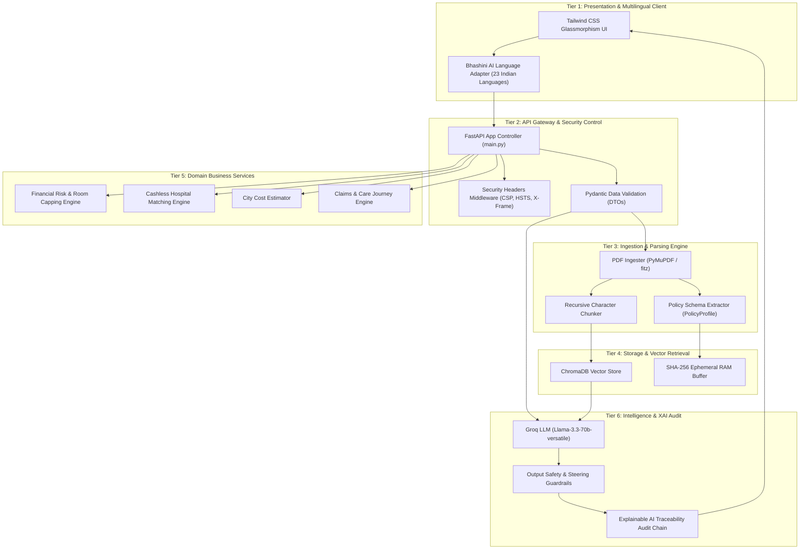

# CareCover Copilot - Healthcare & Policy Navigation System

**Live Web Application:** [https://carecover-copilot-production.up.railway.app/](https://carecover-copilot-production.up.railway.app/)  
**Document Version:** 2.5.0-enterprise  

> CareCover Copilot is an enterprise-grade retrieval-augmented healthcare navigation platform. It parses health insurance policy contracts (PDF format), extracts coverage clauses (Sum Insured, Room Limits, Co-Pay, Pre-Auth rules), compares secondary Super Top-Up policies, predicts out-of-pocket financial risk, queries policy terms in real time, and matches cashless network hospitals with real-time GPS distance calculation and record-level feed provenance.

---

## Key Features

1. **Dual-Policy RAG Engine:** Simultaneous extraction & comparison of Primary Base Policy and Super Top-Up policy schedules with deductible trigger tracking.
2. **DPDP Rules 2025 Privacy & Compliance:** Zero-storage ephemeral RAM processing with 1-click **Purge Data** generating cryptographic deletion receipts.
3. **Cashless Network Hospital Locator:** Real-time hospital matching by city, specialty, cashless status, room rates, and live GPS distance.
4. **Financial Risk & Room Rent Capping Engine:** Predicts out-of-pocket room rent proportional penalty deductions (15%–25%) and procedure sub-limit caps before admission.
5. **Explainable AI (XAI) Audit Traceability:** Step-by-step evidence audit trail (`Document Clause` → `Rule` → `Verdict`) for all Q&A responses.
6. **23 Official Indian Languages:** Multi-lingual interface powered by Bhashini AI integration.
7. **Location-Aware Emergency SOS Bar:** Dynamic national emergency (112) and state ambulance (108) helpline resolution.
8. **Guided 6-Stage Patient Care Journey:** Step-by-step timeline from clinical diagnosis to final hospital discharge and reimbursement claim settlement.

---

## System Architecture

CareCover Copilot follows a multi-tier **Enterprise Retrieval-Augmented Generation (RAG) Architecture** designed to adhere to software engineering best practices, Separation of Concerns (SoC), and the **Digital Personal Data Protection (DPDP) Act 2025**.



### Architectural Layer Breakdown

1. **Presentation & Multilingual Client Layer (`static/index.html`):** Multi-tab glassmorphism UI integrated with Bhashini AI for 23 Indian language translations.
2. **API Gateway & Security Layer (`main.py`):** FastAPI app with CORS whitelisting, HTTP Security Headers (`CSP`, `HSTS`, `X-Frame-Options: DENY`, `X-Content-Type-Options: nosniff`), and Pydantic schema validation.
3. **Ingestion & Document Processing Pipeline (`src/pdf_ingestion.py`, `src/chunking.py`, `src/policy_extractor.py`):** Extracts PDF text via PyMuPDF, chunks context windows, and parses structured `PolicyProfile` objects.
4. **Vector Storage & Context Retrieval (`src/embeddings.py`, `src/retrieval.py`):** Indexes embeddings in ChromaDB and executes similarity searches.
5. **Domain Business Services Layer (`src/`):** Decoupled modules for financial risk calculations (`financial_risk_engine.py`), hospital matching (`eligibility_engine.py`), procedure costs (`cost_estimator.py`), and claims guidance (`claims_engine.py`).
6. **Privacy, Guardrails & Compliance Engine (`src/guardrails.py`, `src/security.py`):** Ephemeral 0-storage RAM processing with 1-click session data purging under DPDP Rules 2025.
7. **Intelligence & Explainable AI (XAI) Traceability Layer (`Groq API / Llama-3.3-70B`):** Step-by-step evidence audit trail (`Document Clause` → `Rule` → `Verdict`).

---

## Tech Stack Summary

- **Frontend UI:** HTML5 + Tailwind CSS + Vanilla JS / Glassmorphism Interface.
- **Backend API:** Python 3.11+ FastAPI & Uvicorn (`2.5.0-enterprise`).
- **Document Processing:** PyMuPDF (`fitz`) text extraction & SHA-256 caching.
- **Vector Engine:** ChromaDB local vector store indexing.
- **LLM Inference:** Groq API (`llama-3.3-70b-versatile`).
- **Translation Engine:** Bhashini AI Translation (23 Indian Languages).

---

## API Documentation Overview

| Endpoint | Method | Description |
| :--- | :--- | :--- |
| `/api/health` | GET | System pipeline status, DPDP 2025 compliance details, module health |
| `/api/extract-policy` | POST | Upload PDF health policy for instant clause extraction & vector indexing |
| `/api/select-sample-policy` | POST | Load pre-configured sample Indian health policy (Niva Bupa, Star, HDFC, Care) |
| `/api/qa` | POST | Query policy terms with RAG retrieval & XAI clause evidence citations |
| `/api/hospitals` | GET / POST | Search network hospitals by city, specialty, and cashless network status |
| `/api/financial-risk` | POST | Calculate out-of-pocket costs, room rent capping penalties, and super top-up triggers |
| `/api/cost-estimate` | GET | Treatment cost estimation by city with procedure sub-limits |
| `/api/compare-policies` | POST | Side-by-side comparison of loaded policy vs standard baseline |
| `/api/bhashini/translate` | POST | Translate Q&A responses into 23 Indian languages |
| `/api/purge-session` | POST | Ephemeral RAM & vector index purge generating DPDP deletion receipt |
| `/favicon.svg` | GET | Health logo favicon SVG asset |

---

## Quick Start & Running Locally

### Backend FastAPI Server
```bash
# Install Python dependencies
pip install -r requirements.txt

# Configure environment variables (.env)
GROQ_API_KEY=your_groq_api_key_here

# Run FastAPI backend server
python main.py
```
Backend API will run at `http://localhost:8000`.

---

## Running with Docker

You can run the entire system in a production container:

```bash
# Using Docker Compose (Recommended)
docker-compose up --build -d

# Using Docker CLI:
docker build -t carecover-copilot .
docker run -p 8000:8000 carecover-copilot
```
Navigate to `http://localhost:8000` in your browser.

---

## Safety & Compliance Disclaimers

- **Informational Only:** Not medical advice or a binding guarantee of insurance coverage.
- **DPDP Rules 2025:** Ephemeral in-memory RAM document processing with 0-hour database storage. Users can trigger an instant session RAM purge and generate an auditable deletion certificate.
- **IRDAI Disclosure:** Independent navigation system. Not officially affiliated with or endorsed by IRDAI. Final cashless settlement is subject solely to direct insurer/TPA confirmation.
